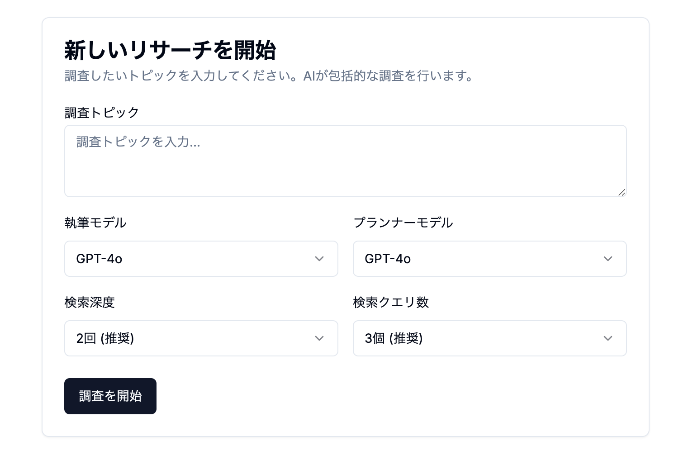

# Deep Research with TypeScript

[日本語](README_JA.md) | English

A sophisticated AI research agent built with TypeScript that automates comprehensive information gathering, analysis, and report generation.

<p align="center">
  
</p>

## 🌟 Try it Live

**A more refined version of Deep Research is already deployed and available at:**

[https://logion.dev](https://logion.dev)

Visit the live site to experience the full capabilities without setting up locally!

## 🚀 Getting Started

### Prerequisites

- Node.js 18+
- npm or bun

### Installation

1. Clone the repository

```bash
git clone https://github.com/rim0o8/deep-research-ts.git
cd deep-research-ts
```

2. Install dependencies

```bash
npm install
# or
bun install
```

3. Create a `.env.local` file with your API keys (see Environment Variables section)

4. Start the development server

```bash
npm run dev
# or
bun dev
```

5. Open [http://localhost:3000](http://localhost:3000) in your browser

## 📝 License

This project is [MIT](LICENSE) licensed.
\*\*
