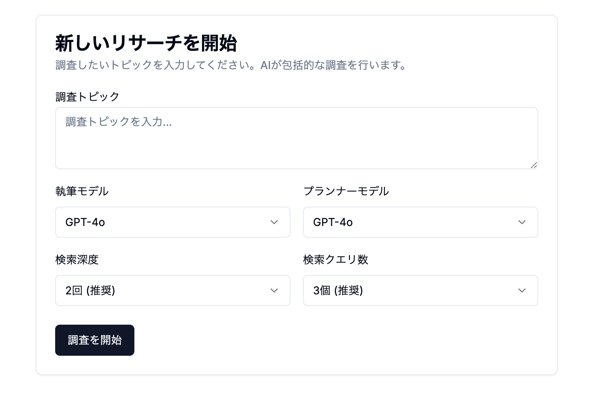

# Deep Research with TypeScript

日本語 | [English](README.md)

TypeScript で構築された高度な AI リサーチエージェントで、包括的な情報収集、分析、レポート生成を自動化します。

<p align="center">
  
</p>

## 🌟 ライブデモ

**Deep Research のより洗練されたバージョンがすでにデプロイされています：**

[https://logion.dev](https://logion.dev)

ローカルでセットアップせずに、ライブサイトで完全な機能を体験できます！

## 🚀 はじめに

### 前提条件

- Node.js 18+
- npm または bun

### インストール

1. リポジトリをクローン

```bash
git clone https://github.com/rim0o8/deep-research-ts.git
cd deep-research-ts
```

1. インストール

```bash
npm install
# or
bun install
```

3. `.env.local` ファイルを作成し、API キーを設定する（環境変数セクションを参照）

4. 開発サーバーを起動

```bash
npm run dev
# or
bun dev
```

5. アクセス [http://localhost:3000](http://localhost:3000) in your browser

## 📝 License

This project is [MIT](LICENSE) licensed.
\*\*
